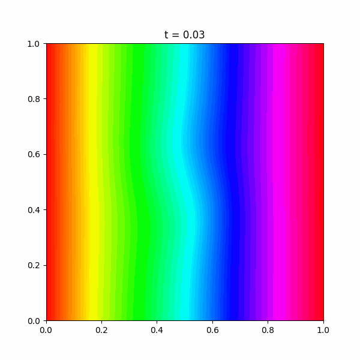
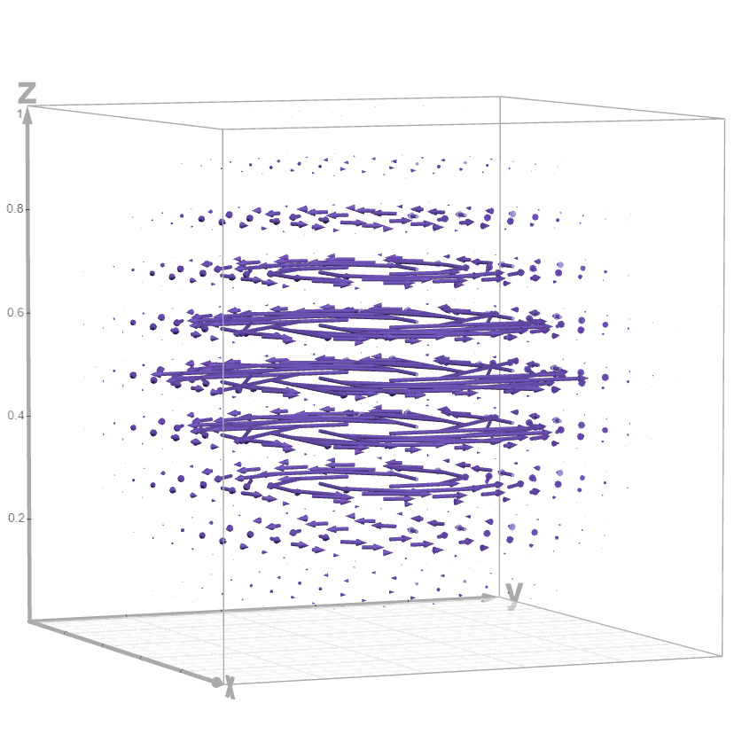
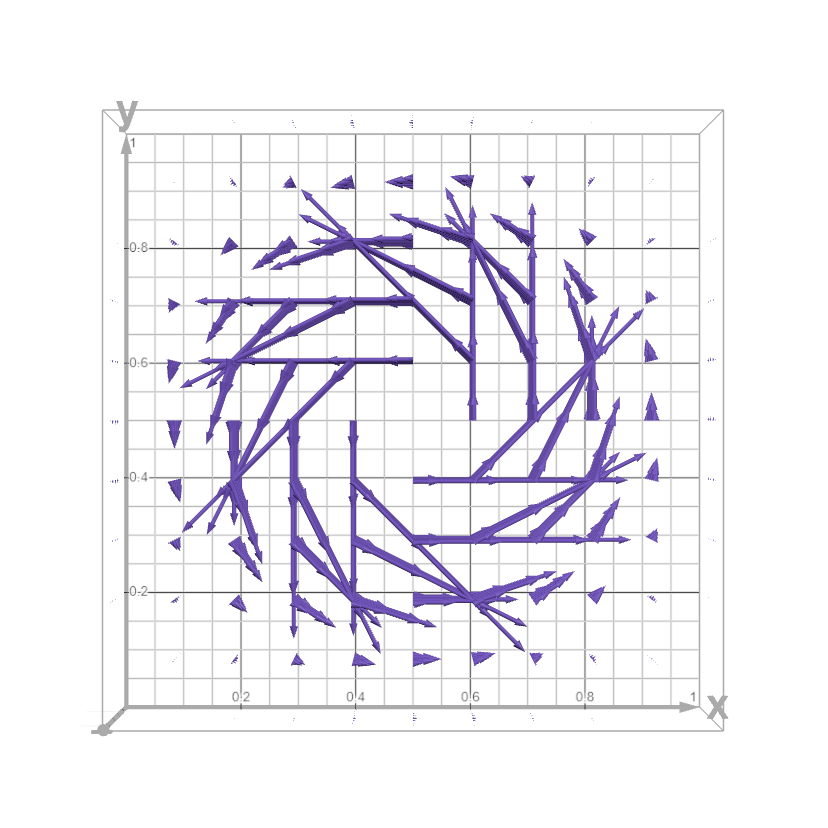
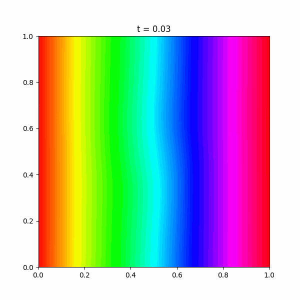
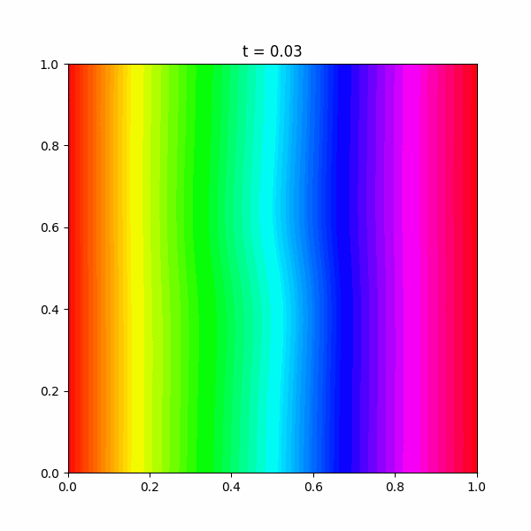
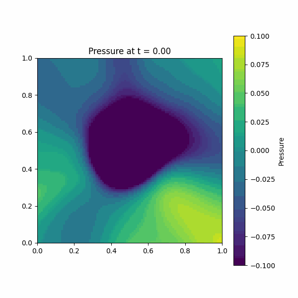
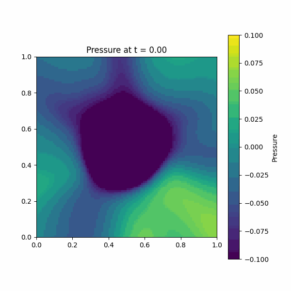
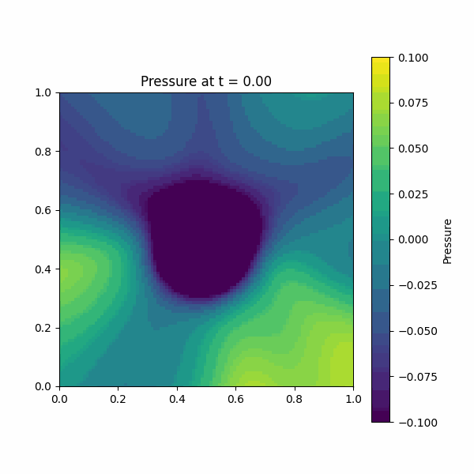

# Fluid Simulation Physics-Informed Neural Network for Vortex-Like Velocity Vector Field
### In this project a classic physics informed neural network is used in order to predict and approximate turbulent-vortex like flow of a non-compressible fluid inside a cube, with dirichlet conditions on $\partial_{\omega}$.

<br>

<br>


### Equation overview
The infamous Navier-Stokes equations govern fluid dynamics with various applications ranging from weather forecasting to aerodynamics simulations. The general form of the equations regarding incompressible flows is 
$\nabla \cdot u = 0$,
$ρ\frac{\partial u}{\partial t}=-\nabla p + μ \nabla^2u + F$
where:


- $u$ is the initial velocity vector field
- $ρ$ is the fluid density
- $p$ is the initial pressure function
- $μ$ is the dynamic viscocity
- $F$ is the sum of the external forces.

In this project we look at the non-compressible case, using *kinematic viscosity* defined as 
$ν=\frac{μ}{ρ}$, $\Leftrightarrow \frac{\partial u}{\partial t}=-\nabla p + ν \nabla^2u + F$.

### Initial conditions
The PDE's initial conditions are $u$ which denotes the initial velocity vector field and $p$ which denotes the initial pressure field scalar for each point. 

However, the initial velocity vector field must satisfy the first equation, and therefore the initial pressure field can be found by substituting the velocity field in the second equation.

For the initial vector field a vortex-like vector field is chosen, center at $(x, y, z)=(0.5, 0.5, 0.5)$.
We center a Gaussian-like scalar sphere at $0.5, 0.5, 0.5$ defined by 
$ψ(x, y, z)= e^{(\frac{(x-0.5)^2+(y-0.5)^2+(z-0.5)^2}{σ^2})}$
We want however, a vector field that satsfies the incompressibility equation, so we build the velocity function from a 2D stream function such that
$\textbf{u}=(u, v, w)=(ψ_x,-ψ_y,0)$
Because $u_x + v_y = 0$, the construction is incompressibly from any $ψ$ smooth in $x, y$.
To construct the velocity vector field, we take the partial derivates  $u=(\frac{\partialψ}{\partial x}, -\frac{\partialψ}{\partial y}, 0)$ such that the vectors create an anti-clockwise circle for each z-intersection, with no vectors moving up or down in the zero axis. Veryfing that the incompressibility equation is true:
$\nabla\cdot u= \frac{\partial u}{\partial x} + \frac{\partial v}{\partial y} = \frac{\partial ^2ψ}{\partial x^2} + \frac{\partial ^2ψ}{\partial y^2} = -\frac{(2x-1)(2y-1)ψ}{σ^2}+\frac{(2x-1)(2y-1)ψ}{σ^2}=0$,
where $σ$ defines the gaussian standard deviation parameter.

The initial pressure scalar funciton must satisfy the 2nd Navier-Stokes equation, it can be approximated by solving the Poisson equation but we leave it up to the PINN to find it, and we rather focus on the velocity vector field evolution over time.

Initial velocity vector field represented here, centered at $0.5, 0.5, 0.5$
<br>

<br>

Top-down view, such that incompressibility is clearly seen:
<br>

<br>


### Boundary conditions
For this fluid simulation the non-compressible fluid is closed in a cube in $R^3$ with $0 < x, y, z, t < 1$ and we also predict the evolution only after the first second.
No-slip dirichlet boundary conditions are used on $\partial ω$ such that $u(x_{\partial ω}, y_{\partial ω}, z_{\partial ω}, t)=0$ for all $0<t<1$.

### Network architecture 
For this PINN approach a simple MLP is used, with 4 input scalar values representing $x, y, z, t$ coordinates and 4 scalar output values representing $\textbf{u}, \textbf{v}, \textbf{w}$ velocity values as well as $p$ value scalar, with respect to an initial pressure anchoring point-value given in the training process.

5 hidden layers are used ranging from 128-256 neurons with *Tanh* activation for all layers attempting to grasp the complexity of turbulent flow. 

### Collocation points

For different parts of the training different collocation points are used, because the equation behaves differently inside the cube, on the edges, and at $t=0$.

Using *Latin Hypercube Sampling* we sample 30.000 points inside the cube (across all values of $t$), 10.000 initial condition points for $t=0$ and 6x1.000 points on boundaries of the cube for $x_{\partial ω}, y_{\partial ω}, z_{\partial ω},$ across all values of $t$.

### Loss function 
Regarding the used loss function, it is crucial to understand that there are many criteria and lossed to minimize for different collocation points, thus our goal is to fit in all of those loss functions at the same time.

More specifically, denoting the model predictions as $\hat{u}, \hat{v}, \hat{w}, p$, starting with the incompressibility equation, the incompressibility loss can be described as
 ```math
\mathcal{L}_{inc}=\frac{1}{N}\sum_{i=1}^{N}(\frac{\partial\hat{u}}{\partial x}(x_i, y_i, z_i, t_i) + \frac{\partial\hat{v}}{\partial y}(x_i, y_i, z_i, t_i) + \frac{\partial\hat{w}}{\partial z}(x_i, y_i, z_i, t_i))^2
```
, 
simply minimizing any non-zero compressibility prediction. 

The pressure "anchor loss" is just 
$\mathcal{L}_{anchor}=(\hat{p}(0,0,0,0)-0)^2$,
enforcing 0 pressure at $0, 0, 0, 0$.

The boundary (non-slip) condition for boundary points at $\partial ω$ can be described as 
```math
\mathcal{L}_{bc}=\frac{1}{N_b}\sum_{(x, y, z) \in \partial ω}^{}(\hat{u}^2(x, y, z, t) +\hat{v}^2(x, y, z, t) +\hat{w}^2(x, y, z, t))
```
.

For the intial condition loss as described above for $t=0$ we assume 
$ψ(x, y, z)= e^{(\frac{(x-0.5)^2+(y-0.5)^2+(z-0.5)^2}{σ^2})}$,
$u_{true}(x,y,z,0)=-\frac{2(y-0.5)}{σ^2}ψ$,
$v_{true}(x,y,z,0)=\frac{2(x-0.5)}{σ^2}ψ$,
$w_{true}(x,y,z,0)=0$
and the final loss is 


```math
\mathcal{L}_{\text{ic}} \;=\; 
\frac{1}{N_0} \sum_{(x,y,z,0)} 
\left\|
\begin{bmatrix}
\hat{u}(x,y,z,0) \\
\hat{v}(x,y,z,0) \\
\hat{w}(x,y,z,0)
\end{bmatrix}
-
\begin{bmatrix}
u_{\text{true}}(x,y,z,0) \\
v_{\text{true}}(x,y,z,0) \\
w_{\text{true}}(x,y,z,0)
\end{bmatrix}
\right\|^2
 ```

Finally, the residuals for each velocity component are:

```math
R_u = \frac{\partial \hat{u}}{\partial t}
+ \hat{u}\frac{\partial \hat{u}}{\partial x}
+ \hat{v}\frac{\partial \hat{u}}{\partial y}
+ \hat{w}\frac{\partial \hat{u}}{\partial z}
+ \frac{\partial \hat{p}}{\partial x}
- \nu \left(
\frac{\partial^2 \hat{u}}{\partial x^2} +
\frac{\partial^2 \hat{u}}{\partial y^2} +
\frac{\partial^2 \hat{u}}{\partial z^2}
\right)
```
```math
R_v = \frac{\partial \hat{v}}{\partial t}
+ \hat{u}\frac{\partial \hat{v}}{\partial x}
+ \hat{v}\frac{\partial \hat{v}}{\partial y}
+ \hat{w}\frac{\partial \hat{v}}{\partial z}
+ \frac{\partial \hat{p}}{\partial y}
- \nu \left(
\frac{\partial^2 \hat{v}}{\partial x^2} +
\frac{\partial^2 \hat{v}}{\partial y^2} +
\frac{\partial^2 \hat{v}}{\partial z^2}
\right)

```
```math
R_w = \frac{\partial \hat{w}}{\partial t}
+ \hat{u}\frac{\partial \hat{w}}{\partial x}
+ \hat{v}\frac{\partial \hat{w}}{\partial y}
+ \hat{w}\frac{\partial \hat{w}}{\partial z}
+ \frac{\partial \hat{p}}{\partial z}
- \nu \left(
\frac{\partial^2 \hat{w}}{\partial x^2} +
\frac{\partial^2 \hat{w}}{\partial y^2} +
\frac{\partial^2 \hat{w}}{\partial z^2}
\right)
```
The final PDE loss is:
```math
\mathcal{L}_{\text{pde}} \;=\;
\frac{1}{N} \sum_{i=1}^N \Big( R_u^2 + R_v^2 + R_w^2 \Big)
```
and the complete (weighted) total loss is:
```math
\mathcal{L}_{\text{total}} \;=\;
\lambda_{\text{pde}} \, \mathcal{L}_{\text{pde}}
+ \lambda_{\text{inc}} \, \mathcal{L}_{\text{inc}}
+ \lambda_{\text{ic}} \, \mathcal{L}_{\text{ic}}
+ \lambda_{\text{bc}} \, \mathcal{L}_{\text{bc}}
+ \lambda_{\text{anchor}} \, \mathcal{L}_{\text{anchor}}
```

### Training process

The training loss is much too complicated for a neural network to converge at once given any number of collocation points, especially when the flow is turbulent and unpredictable.
To tackle this, the network is trained across different loss functions (and their corresponding collocation points) seperately and then gradually all of the (weighted) losses are used toghether. 

More specifically, the MLP is initally trained only over inital condition loss function on initial condition collocation points as a warm up over 2000 epochs.
After, the model uses the total loss weighted equally but using a ramp factor, multiplying by $epoch / 1000$$, ramping up over the first 1000 epochs. Finally, the model is trained on the boundary points over 500 epochs on boundary collocation points.

Total training time is about 3 hours and 10 minutes on a 2.9GHz intel i5 CPU.

### Animation of fluid over different xy intersections for kinematic viscosity = 1.5e-06

$z=0.25$
<br>

<br>


$z=0.5$
<br>

<br>


$z=0.75$
<br>

<br>

### Animation of relative pressure over different xy intersections

$z=0.25$
<br>

<br>


$z=0.5$
<br>

<br>


$z=0.75$
<br>

<br>

## Numerical solver 

#### Core idea:

```python
# Pseudocode implementation
# step 1 - solving for momentum, ignoring pressure and incomnpressibility equation:
u* = u^n + Δt * [-(u^n·∇)u^n + ν∇²u^n] # simple eulers
# Result u* is a predicted, *not* divergence free velocity.
# step 2 - incompressibility correction:
u^(n+1) = u* - Δt∇p^(n+1)
# step 3 - solving for pressure field, using the poisson equation
∇²p^(n+1) = (1/Δt)∇·u*
# lastly, apply BCs to vector field.

# iterate for N collocation points over R3, for 60 timesteps over a second?
# save velocity vectors for each point and pressure scalar, then compare.


```


